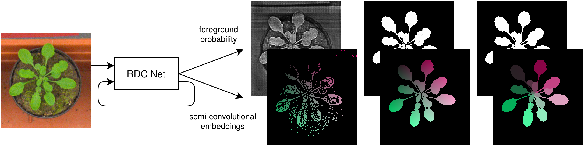

# RDCNet: Instance segmentation with a minimalist recurrent residual network (MICCAI-MLMI 2020)
Official tensorflow implementation of **RDCNet**, a simple and efficient neural architecture for the segmentation of 2D and 3D images. For details, please refer to:

**RDCNet: Instance segmentation with a minimalist recurrent residual network**\
Raphael Ortiz, Gustavo de Medeiros, Antoine H.F.M. Peters, Prisca Liberali, Markus Rempfler\
**[[Paper](https://arxiv.org/abs/2010.00991)] [[Video](https://youtu.be/ew3SoziSSb8)]**

<br><br>
<p align="center">  </p>

## Installation
This code has been tested with python 3.7, Tensorflow 2.3, Cuda 10.2, cuDNN 7.6.5 on Ubuntu 18.04

- Clone this repository
```cli
git clone https://github.com/fmi-basel/RDCNet
```
- Setup up a conda environment (with Cuda and cuDNN compatible for Tensorflow 2.3, adapt accordingly)
```cli
conda create -n rdcnet -c anaconda python=3.7 cudatoolkit=10.1 cudnn
conda activate rdcnet
```
- Install this package
```cli
pip install RDCnet/
```
- Run the unit tests (optional)
```cli
cd RDCNet
pytest tests/
```

## Usage
A complete example workflow is provided as a Jupyter [notebook](https://github.com/fmi-basel/RDCNet/tree/master/examples)

### Instantiating a RDCNet model
A RDCNet model following the [tf.keras.Model](https://www.tensorflow.org/api_docs/python/tf/keras/Model) API can be instantiated by:

```python
from rdcnet.models.rdcnet import GenericRDCnetBase
model = GenericRDCnetBase(input_shape=(None,None,None,1),
                          downsampling_factor=4,
                          n_downsampling_channels=16,
                          n_output_channels=4,
                          n_groups=8,
                          dilation_rates=(1, 2, 4, 8),
                          channels_per_group=32,
                          n_steps=5,
                          dropout=0.1)
```

### Adding segmentation heads to an existing model
Instance segmentation heads (semi-conv embeddings + semantic class) can be added to a model having at least `n_classes + n_spatial_dims` output channels.

```python
from rdcnet.models.heads import add_instance_seg_heads
model_with_heads = add_instance_seg_heads(model, n_classes=2)
```
### Embeddings postprocessing on GPU
We also provide a GPU implementation of the Hough voting scheme to convert predicted embeddings to instance labels.

```python
from rdcnet.postprocessing.voting import embeddings_to_labels
labels = embeddings_to_labels(embeddings,
                              foreground_mask,
                              peak_min_distance=2,
                              spacing=(1,0.23,0.23))
```

### Hyperparameters selection
These few rules of thumb can be used to select hyperparameters for a new project

- **down/up sampling factor** highest factor where instances can still be visually recognized
- **max dilation rate** `object_size << 2 * dilation_rate * downsampling_factor << training_patch_size`
- **network capacity** primarily adjust the number of groups and channels per group
- **number of iterations** 5-6 is usually a good balance between performances and computational cost

## Citation
If you find this work useful, please consider citing:

```bibtex
@inproceedings{ortiz2020,
  title={RDCNet: Instance segmentation with a minimalist recurrent residual network},
  author={Ortiz, Raphael and de Medeiros, Gustavo and Peters H.F.M., Antoine and Liberali, Prisca and Rempfler, Markus},
  booktitle={International Workshop on Machine Learning in Medical Imaging},
  year={2020},
}
```
